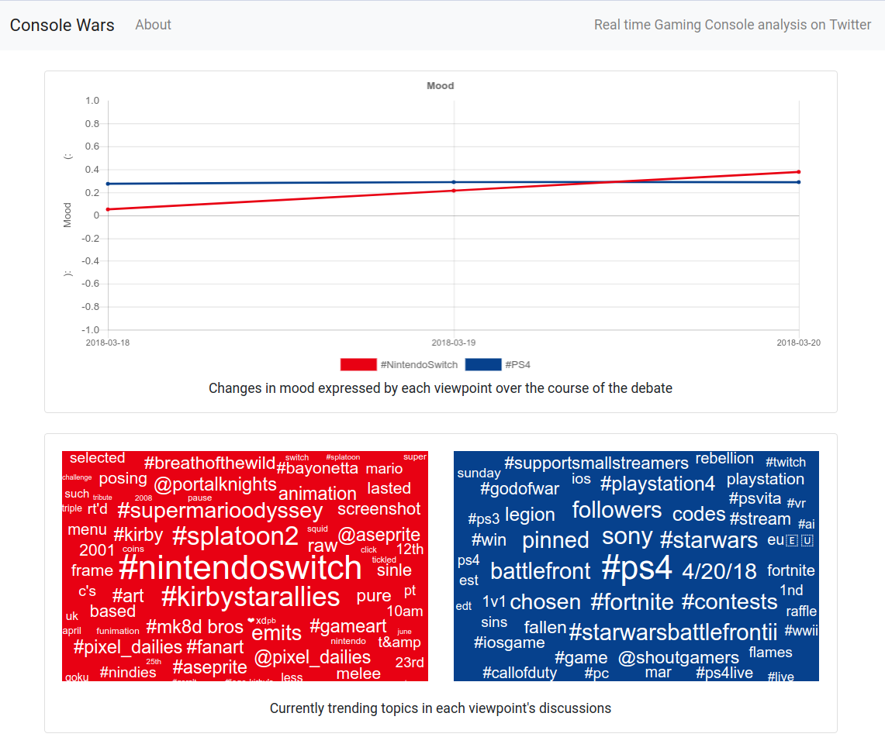

# Sentiment Analysis in Divisive Domains

### A microservices based, machine learning pipeline for real-time sentiment analysis of Twitter data.

[](https://travis-ci.com/David-Byrne/FYP)

This, together with an accompanying thesis, was submitted as my Final Year Project for the BSc in Computer Science and Information Technology at NUI Galway.

As an initial, real-world test case to validate the system, it was applied to Tweets regarding Ireland's 2018 referendum on whether or not to repeal the 8th amendment. The results are displayed in real-time at [hateful8th.com](http://hateful8th.com/).

## Getting Started

First, ensure [Docker](https://docs.docker.com/install/) and [Docker-Compose](https://docs.docker.com/compose/install/) are installed.

Next, create a `secrets.json` file at the root of the directory. You can base it off the `secrets.sample.json` file provided. This will involve creating Twitter API credentials at their [developer site](https://apps.twitter.com/) and filling them into the appropriate locations in the secrets file.

You can customise the `config.json` file to configure the pipeline to analyse any domain you like (see [Example Config](#example-config) below for further details).

Now, run `docker-compose up` from the root of the directory.

Once that informs you all the services have started, open [localhost:8000](http://localhost:8000/) in your browser and you should see the web frontend running.

## Architecture

Each of the microservices that make up the overall system get their own root level directory. They are:
* **Streamer**: This service connects to Twitter’s streaming API and receives the tweets we are interested in. Its role is to gather tweets, filter out any tweets deemed non-relevant and then send them onwards in the pipeline.
* **Classifier**: This service uses machine learning and natural language processing techniques to determine whether tweets are expressing a positive or a negative sentiment.
* **Database**: This stores the results of the data processing being done by the previous services in the pipeline.
* **Analyser**: This analyses the data stored by the database microservice, looking for trends and general insights.
* **Cache**: This is short term storage for the results of the analyser. Rather than having to re-process all the data each time, we can store the most up to date version of it here.
* **Websocket**: This sends the latest results of the data analysis to the connected clients as soon as they are calculated. As it focuses on transferring time sensitive data, low latencies are highly important.
* **Web**: This sends HTML pages to the clients when they load the page. This HTML is then inflated using the data sent by the websocket service to display the latest results and analytics.

The following system architecture diagram displays how they all connect together:


## Example Config

The current configuration included in the `config.json` file is for analysing the 8th amendment debate, and used for [hateful8th.com](http://hateful8th.com/). This can easily be changed to analyse any other topic instead. For a second example, we will compare the Twitter sentiment regarding 2 popular gaming consoles in the United States: the Nintendo Switch and the PlayStation 4. The appropriate `config.json` file contents is as follows:

```JSON
{
    "topic1": {
        "name": "#NintendoSwitch",
        "colour": "#e80113"
    },
    "topic2": {
        "name": "#PS4",
        "colour": "#06418d"
    },
    "name": "Console Wars",
    "tagline": "Real time Gaming Console analysis on Twitter",
    "supportedLanguages": ["en"],
    "supportedTimezones": ["Eastern Time (US & Canada)", "Central Time (US & Canada)",
        "Mountain Time (US & Canada)", "Pacific Time (US & Canada)"]
}
```

Following the steps included in the [Getting Started](#getting-started) section above should result in the web front looking similar to the image below. The exact data displayed will obviously depend on what Tweets have been collected however.

