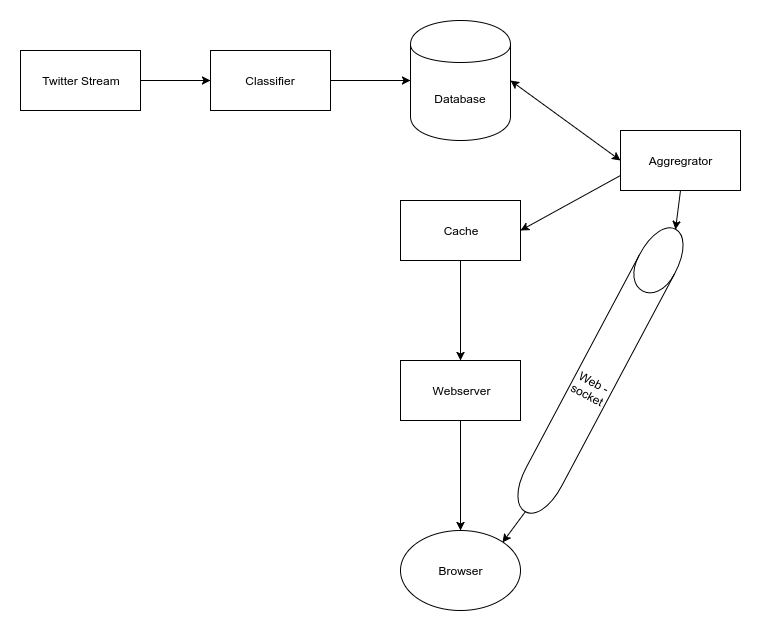
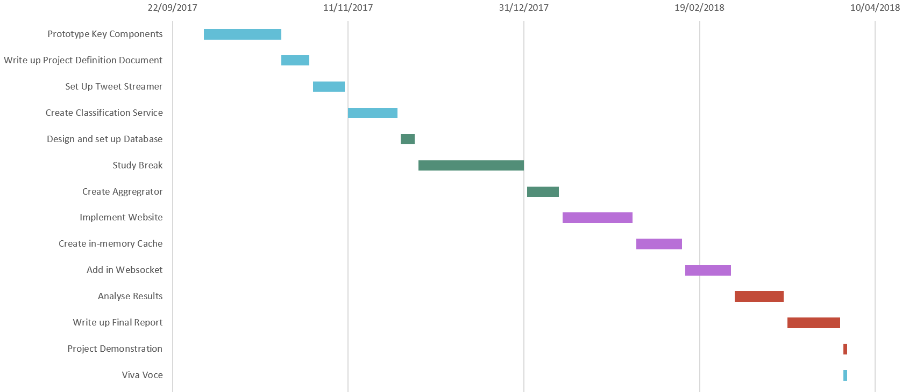

# Real-Time Contrasting of Political Sentiment on Twitter

## Project Definition Document

***

## Project Description
> What we're doing

Ireland is set to hold a controversial referendum in the Summer of 2018 on
whether or not to repeal the 8th amendment. The 8th amendment of the Irish
Constitution acknowledges "the right to life of the unborn, with due regard
to the equal right to life of the mother" [1]. Effectively, this means a ban
on abortion in almost all circumstances. This has been criticised by various
international organisations including the United Nations who describe it as
"violating women's human rights" [2] and Amnesty International who claim it
puts "women's health at great risk" [3].

Many people use Twitter to share their opinions on topical events. This makes
Twitter a valuable source of data for sentiment analysis on current events as
people can see something and Tweet a reaction almost instantly.

This project involves taking the lead up to the 8th amendment referendum
as a case study on sentiment classification in a divisive domain and
displaying real-time sentiment scores for both sides. As an addition to the
sentiment analysis aspect, a word cloud will be created for each side
displaying the terms they use most relative to the other side.

## Purpose
> Why we're doing it

Obviously when dealing with a topic as sensitive as abortion, emotions are
high on both sides of the debate. Modern politics relies heavily on social
media to spread awareness and influence undecided voters. Both sides are
expected to campaign heavily all across social media. This should lead to
strong displays of sentiment from both sides of the debate. Twitter is an
ideal case study to measure this sentiment due to its real-time nature and
character limit that enforces conciseness.

Creating a word cloud of each side's relatively most used terms should also
give us an insight into what areas each side are focusing on. We'd hope to
see differences in the language used by both sides, and perhaps what type of
arguments they are using to try and convince undecided voters.

Being able to classify sentiment in real-time will hopefully give us great
insight into the nature of the campaign and how it changes over time. We'd
hope to see spikes in either positive or negative sentiment correlating with
important events in the lead up to the referendum. We'd also hope to see
what, if any, differences the two sides have on average sentiment over the
campaign and how it affects them.

## Problem/Opportunity
> Why it's worth doing as a project
> Maybe merge with above?

Although the vote itself will happen after the final submission is delivered,
the referendum campaign still gives us a great opportunity to analyse
sentiment in real-time for what looks to be one of the most controversial
votes Ireland has had in years.

Creating the system in the run up to the referendum will allow us to collect
far more Tweets than would be possible if we only started after the
referendum, as the normal Twitter Search API only allows you to query the
last 7 days worth of Tweets [4]. There is an enterprise level search but
that only allows querying of up to 30 days of historical data [5]. Both of
these searches focus on relevance rather than completeness meaning it would
be an incomplete dataset. Streaming the relevant Tweets from Twitter and
storing their IDs will allow us to build a dataset focused on this
referendum that's larger and more complete than anything that could be
generated after the campaign.

## Project Goal
> Ideally what we hope to achieve

The goal of the project is to create a system that can give us great insight
into sentiment on any controversial issue on Twitter. We will use the 8th
amendment as the initial proof of concept but the system will ideally be
able to switch domain with minimal changes needed.

We will investigate what strategies give us the best insights into the
sentiment of the population and also the differences in sentiment between
the two sides of the debate. Various machine learning and natural language
processing (NLP) techniques will be attempted.

The results of the real-time analysis and classification will be displayed
on a live updating website. This should be designed in a such a way that it
can be clearly understood by a general member of the population, allowing
them to gain an insight into the sentiment on Twitter from both sides of the
debate.

## Project Objectives
> Steps that will bring us to our goal
> Rename to project structure/architecture?

The system will be designed as a group of modular sections, that when joined
together form a complete pipeline. Data will come into the pipeline directly
from the Twitter streaming API and the results will be displayed on a webpage
in real-time. Various processing techniques will be applied to the data as it
flows through the pipeline. Each of these sections fulfills an objective of
the project.

The first section of the pipeline will be the Twitter streamer. This will
connect to the Twitter streaming API and listen for specific hashtags and
terms related to the 8th amendment. It will drop any Tweets that we feel
would add unwanted noise to the results such as Tweets in languages other
than English and Tweets from countries outside Ireland. This will then pass
on the Tweet's important attributes to the next section of the pipeline.

The next section is the Tweet classifier. This takes in Tweets from the
streamer section, preprocesses them to prepare them for classification,
classifies them into positive and negative sentiment and stores them into
a database. It also stores other attributes for them including their
viewpoint (repeal the 8th or save the 8th), their Tweet ID and their
timestamp to allow for easier querying later.

The next section is the aggregator. It is run on a regular interval and
queries the database for recent data. This can generate average sentiment
for a given time interval, helping us to see the trends over a longer period
of time. It will also generate the word clouds for each side based on their
recent Tweets. These aggregated results can be stored back in the database
to avoid having to recompute them all every time.

The final section is the webserver. This will create the webpage that
displays the results in real-time. It will be able to query the database and
send this data to the clients to keep them up to date.

Other sections could be added to improve performance and reliability of the
overall system such as an in-memory cache that stores the latest results,
reducing expensive database queries by the webserver. We could also
introduce a websocket that pushes new results from the aggregator directly
to the clients, saving them having to make regular Ajax requests looking for
new data.

## Technologies
> Technologies used and why

The main architecture of the system will be based around microservices.
Microservies are loosely coupled services that each handle a business case,
and when linked together, serve a business goal. They allow more flexibility
in development as each microservice can use its own technology stack.

The main programming language used across the project will be Python,
specifically Python 3. Python is a high-level programming language that
supports many paradigms including procedural and object-orientated
programming. This makes it very easy to transition from simple REPL commands
and scripts to a fully structured project comprised of modules and classes.
Python isn't my strongest language but it has many libraries useful to this
project and is very popular in the area of data science so I believe it is
the right tool for the job. I will hopefully come out of this project with a
much deeper understanding of Python and its ecosystem.

The database that will store all the data from this project will probably be
PostgreSQL. It is a fully free, open source, object-relational database
system and strongly conforms to the ANSI-SQL 2008 standard [6].

The front end logic of the system will be written in JavaScript, as it is
supported by all major web browsers. Many frameworks such as AngularJS,
React and Vue.js build upon JavaScript with the aim to simplify creating web
apps. I feel it is too early in the project to make a decision on which,
if any, of these to use. All of the frameworks mentioned above are well
developed and would all support any of the requirements I have for the front
end.

## Project Timeline
> Overview of key milestones with their target date
> Gantt chart either here or at the end

So far, I've met with my supervisor Dr. Josephine Griffith to discuss the
project and the direction we will take it in. I've written a few Python
scripts to act as proofs of concept for the key areas of the project
(accessing the Twitter API, classifying sentiment, creating word clouds...)

* October 31st - Have Project Definition Document complete.
* November 30th - Have first half of pipeline up and running, i.e. We're
collecting tweets, classifying them and storing these results in a database.
* January 31st - Have the core aspects of the second half of the pipeline up
and running, i.e. Sentiment is being aggregated over time intervals and we
have a webpage showing real-time results.
* February 28th - Have implemented the performance enhancing systems such as
the in-memory cache and the websocket.
* March 31st - Have the results analysed and the final report written up.
* April ??th - Deliver project bench demonstration and Viva Voce.

## Project Scope
> What is and isn't included

The main aim of the project is to create a system that analyses sentiment
on Twitter regarding divisive topics and displays the results in a dashboard.
The tasks described in the above sections that result in the fulfillment of
this goal are all part of the project scope.

Predicting the result of the referendum is not part of the scope. We aim to
discover the sentiment of people who support each side, not discover the
sentiment of the general population regarding the referendum. Predicting the
results of referenda from Twitter sentiment has been attempted before and
does not always give results that correspond to the final result of the
vote [7].

## Assumptions and Constraints
> What it says on the tin really...

We're assuming there will be enough discussion on Twitter to generate
sufficient data to analyse. Given how controversial a topic Abortion is and
how both sides have already begun campaigning I feel this is a safe
assumption.

We're assuming both sides will continue to use hashtags to tag their
discussions, making it easier to find the relevent discussions on Twitter.
We currently plan to follow "#SaveThe8th" and "#RepealThe8th" hashtags on
Twitter but we can update these if needed.

We're constrained by what data the Twitter API makes available to us. The
Twitter streaming API allows you to filter by up to 400 key words and will
return up to about 1% of all Tweets [8]. Both these constraints should not
be a problem to this project however.

## References
[1] - https://www.taoiseach.gov.ie/DOT/eng/Historical_Information/The_Constitution/Constitution_of_Ireland_-_Bunreacht_na_h%C3%89ireann.html

[2] - https://www.irishtimes.com/news/health/irish-abortion-law-violated-woman-s-human-rights-un-says-1.3118145

[3] - https://www.amnesty.ie/abortion-faq/

[4] - https://developer.twitter.com/en/docs/tweets/search/overview/basic-search

[5] - https://developer.twitter.com/en/docs/tweets/search/overview/30-day-search

[6] - https://www.postgresql.org/about/

[7] - https://aran.library.nuigalway.ie/handle/10379/6239

[8] - https://developer.twitter.com/en/docs/tweets/filter-realtime/overview
