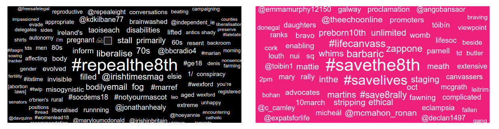
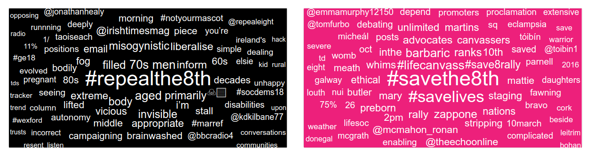
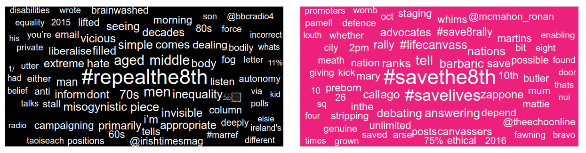
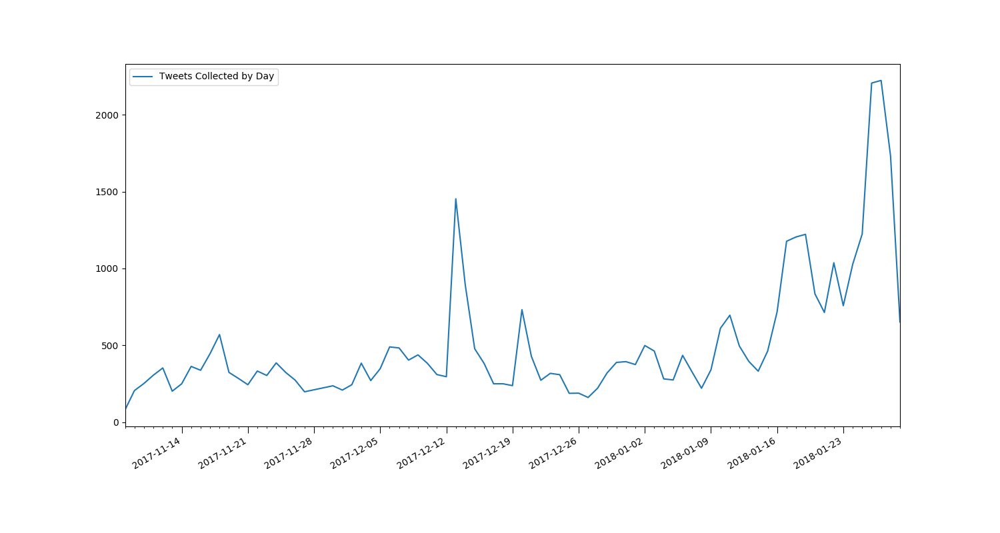
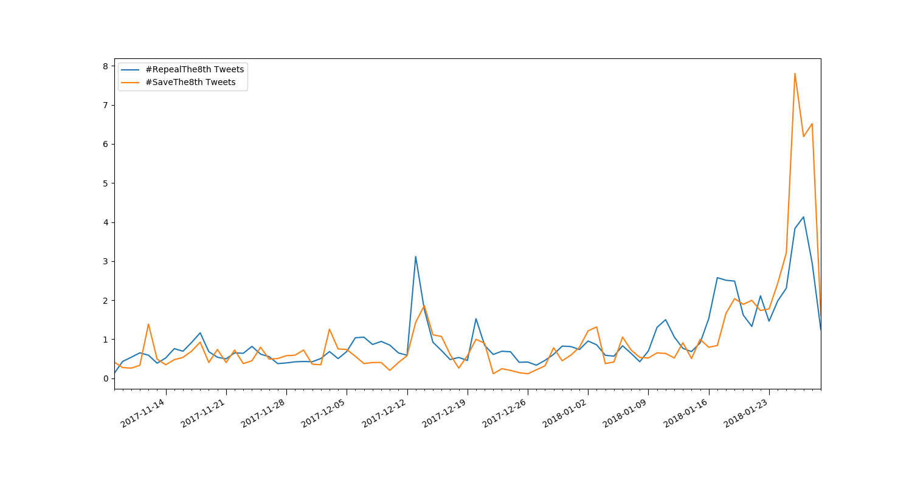

## Broken Links
I first decided to look into the curious case of the broken links. I
figured I should work back from the wordcloud to the database, and then use
the tweet ID from that to find the tweet on Twitter. I could then see if
the tweet the link is referring to was still working or not, helping
diagnose the issue.

So I found a link that was large enough in the Save cloud,
'https://t.co/3l28q56gis', and ran an SQL query pattern matching the link
against the text of all of the tweets. This resulted in ... 0 results. I
could tell that wasn't right since the link in the word cloud had to be
coming from somewhere, so something odd was happening. After running a few
other pattern matching queries to ensure my syntax was correct I went back
to looking at the link. That's when I started to develop a hunch. The only
text processing I was doing on the tweets was splitting on spaces, and
changing everything to lower case; what if Twitter's short links were all
case sensitive? It'd make sense, they only use 10 characters to uniquely
identify links so case sensitivity would allow many more possible
combinations.

I changed my SQL query so that I was just looking for 'https://t.co/3l28',
with only one letter I could check both it's upper and lower cases to see
if either returned a match. Sure enough, a bunch of IDs are returned. When
I cross-checked their contents, I found 'https://t.co/3l28Q56GiS' common to
them all. By converting all my word cloud words to lower case, I was
breaking Twitter's shorthand link system. Now we'll be filtering these links
out of the wordcloud anyway but it's still good to get it figured out.

---

## Missing '#SaveThe8th'
The next strange occurrence to investigate was the missing '#SaveThe8th'
term from the Save wordcloud. From looking through the data sent to the
client, I was able to see it was given a score of ~10.5. Considering it
should be up >=500 like '#RepealThe8th', something was going badly wrong.

The next step I did was add some verbose logging to the word cloud
generation part of the analyser service. From this I was able to see the
term appeared in the Save data 678 times, but also in the repeal data 67
times... That's the issue, those 67 occurrences shouldn't exist. 678/67
gives us roughly the score that appears in the wordcloud so the actual
TF-IDF calculations are working as expected. This points to a bug occurring
much earlier in the pipeline, back in the Streamer service... I checked to
see if the reverse was happening and I found '#RepealThe8th' occurred 1010
[1] times in the Repeal data and 0 times in the Save data, exactly as
expected. For some reason, this bug was only causing '#SaveThe8th' and not
'#RepealThe8th' to appear in the wrong category.

Looking back in the Streamer service code, nothing immediately seemed amiss.
When I looked a little closer at the line where I'm deciding viewpoint, I
realised I might have spotted an issue:
```python
"viewpoint": "repealthe8th" in tweet_text.lower()
```
At this point I've already dropped the tweet if it contains both (or
neither) or the hashtags we're looking for. But what if someone's tweet
contains '#SaveThe8th' but they also say 'repealthe8th'. It only has one
of the hashtags so it wouldn't have already been dropped, but it would be
allocated to the wrong viewpoint. Thinking I had solved it, I wrote an SQL
query to see if any tweets were marked Repeal but actually contained
'#SaveThe8th'. And, as I had expected, I got results. I checked the first
result returned, [956265187560116225](https://twitter.com/MariaLaoise/status/956265187560116225), and it
contained both hashtags... Not what I was expecting. Tweets like these do
explain why the Save hashtag appears in both categories but it shouldn't
have ever entered the system, I'm meant to be dropping tweets that contain
both hashtags. Marking the earlier bug involving the setting of the
viewpoint attribute as a ToDo item, I turned my attention to the section of
code that's meant to be dropping Tweets that contain both hashtags.

I tested it with some mocked data but I couldn't get any tweet with both
the hashtags I'm searching for to trigger the occurrence I was
investigating. Running out of ideas, my next plan was to write up a short
script that got the offending tweet discovered above and run that through
the filter. It was dropped like it should be but it doesn't answer why it
was allowed into the dataset in the first place.

The only possible reason left that I can think of is that the tweet's
attribute that contains the list of hashtags that are used didn't match the
text contained in the tweet itself originally. This would explain how it
passed through the filter the first time but it didn't once I investigated
it, Twitter must have updated it in the mean time. I'm not convinced this is
the reason but I can't think of any other explanations so it's the one I'm
going with for now. Due to the potential bug discovered above, I wanted to
refactor the way the viewpoint is decided anyway so I took advantage of
the opportunity and removed the use of the tweet's hashtag attribute,
instead only using the tweet's text to decide everything.

[1] = Just to note the difference in totals between Repeal (1010) and
Save (678) is nothing to worry about. I was investigating this at the same
time as increasing the size of the wordcloud dataset to 1000. Repeal caught
up to the new threshold much faster than Save so the scores match the
available data quite closely. Also the reason we've more occurrences than
Tweets is that some people are using the hashtag more than once per tweet,
causing the slight difference.

---

## Deciding viewpoint
Given we can't trust Twitter's own hashtag field to contain the correct
data, finding what hashtags are contained in a tweet was surprisingly
complicated.

The first option was string matching, checking is `"#savethe8th" in
tweet_text`. This wouldn't work because something like "#savethe8thisstupid"
would also match, even though it shouldn't

The next option was splitting the tweet into words and then checking for
intersections between the list of words and the list of hashtags. This is
also awkward since something like "I want to #savethe8th." won't match, due
to the period. There's an impossibly large amount of characters to try split
on so this won't work out either.

The only real option left was regex, [unfortunately](https://softwareengineering.stackexchange.com/questions/223634/what-is-meant-by-now-you-have-two-problems).
Now luckily I was able to use a fairly simple regex pattern to match
hashtags so it's not as bad as I feared originally.

---

## Common Words
Despite the TF-IDF weighting we're doing, some common words that don't
convey much meaning still appear, eg "don't", "I'm", "had"... We already
have a Twitter corpus that we're training the classifier on so I decided
to use evidence from that as well to calculate an IDF score. I recorded
the wordcloud's contents at 3 different weights for evidence from this new
corpus.

#### Corpus @ 1.0 weighting


#### Corpus @ 0.1 weighting


#### Corpus @ 0.0 weighting (control)


Unfortunately, this dataset was collected during the run up to the UK's
general election in 2015. This means it contains more political terms than
normal text would, which isn't great since we're focusing on a referendum
debate... The 100 most frequent words include "labour", "vote" and "support"
so I don't think it's an ideal benchmark of normal twitter language. I've
left its weighting at 0.1 for now but it might be a good idea to find a
better dataset to replace it in the future.

---

## Data Analysis

This was a big week in the debate, with the first polls showing a clear
majority for repeal, and Leo Varadkar saying he will campaign for more
liberal abortion laws. This increased activity can be seen in the overall
tweet count, especially on the days these stories broke. Monday is also
looking like it will be a very big day, with ministers expected to formally
agree to hold the referendum and the Taoiseach is expected to officially
outline his position on the subject.

#### Overall Tweet Count


In the past, it was hard to compare tweet activity between the two sides
due to the large difference in the volume of tweets. Although the Save side
have become a lot more active in the last few days, there's still too big
a gap between the counts, especially on more historical data. To get around
this, I wrote a query that displays the day's tweet count divided by the
daily average tweet count for both sides. This now allows us to see what
days were more important for each side, which was sometimes hidden in the
past due to the scales being so different.

#### Relative Daily Tweet Count by Viewpoint


This is a much more interesting graph than the previous version comparing
the tweet count by viewpoint. We can see details that were previously hidden
(eg the spikes only occurring for one side on Nov 12, Jan 11). It also shows
how much the recent news stories have increased the #Save activity.
