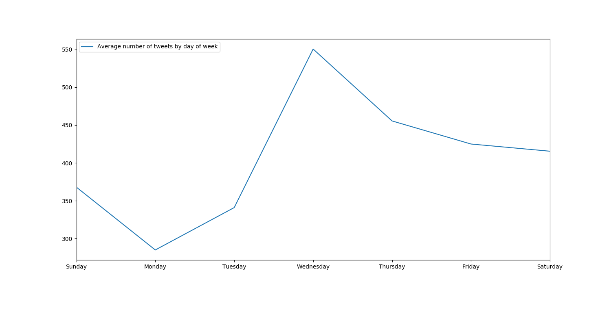
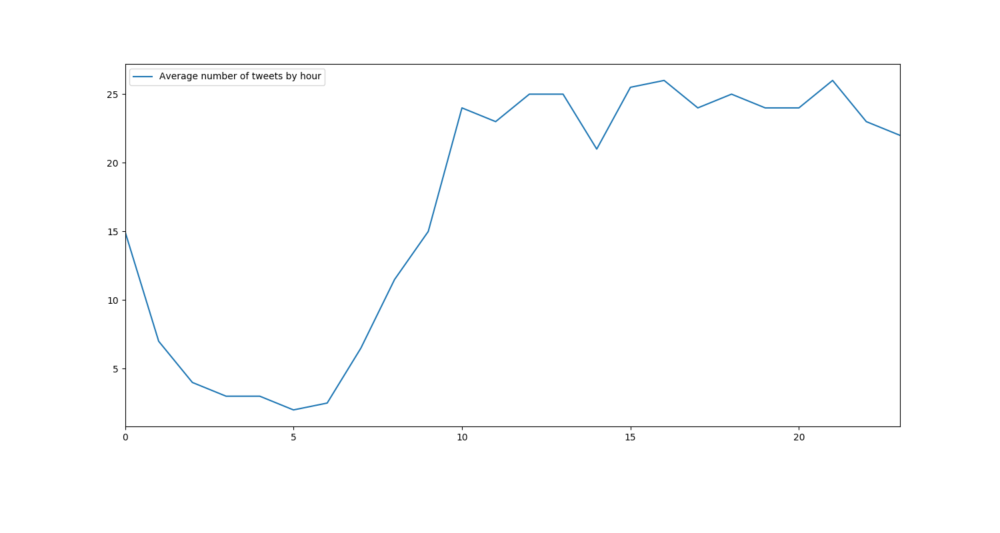

## UI improvements
The website is laid out better for mobile screens. I've also added in a
loading bar which appears if the connection to the websocket doesn't happen
pretty much straight away. This improves the UX on the rare occasion that
the websocket takes a few seconds to connect, so users aren't left with
a blank page and wondering if it's broken. The sentiment graph has also been
scaled to [-1,1] and given simple emojis to clarify the meaning of the
values.

## Tweet Time analysis
I added 2 extra views to the static analyser, median number of tweets per
hour of the day and median number of tweets per day of the week. Neither
yielded any spectacular results but they're both worth mentioning.

#### Day of Week

Interestingly, the most active day in the debate seems to be a Wednesday.
I can't think of any particular reason why - we're calculating the median
to avoid the outlier days having a huge impact. Monday is the least busy
which could potentially be caused by the lull of news over the weekend
coupled by people being back to work and having less time to tweet.

#### Hour of Day

The hourly activity graph is quite close to what you would probably expect.
Very little activity over the night when most people would be asleep, with
a sharp increase in activity from 7am onwards as people wake up. The
activity during the main period of the day (say 10am - 12am) is fairly
consistent without any major differences. Once it passes midnight however,
activity drops sharply as people go to sleep.

## Outage
Probably worth mentioning we had a bit of an outage on Saturday. Shortly
after 6am, the classifier microservice stopped being able to insert data
into the database. The errors that were thrown by the Postgres connection
library I'm using had no details to help debug the cause. I'm suspecting
it's the same (unknown) error that last occurred a few months ago, shortly
after I started collecting tweets. I noticed the outage Saturday evening at
about 7pm and I manually restarted the classifier microservice. This
immediately rectified the issue and ended the 13 hour outage.

To help prevent this issue occurring again, I've stopped catching Postgres
errors in the classifier. They didn't contain any useful into I could use to
debug so instead I'm going to let them crash out and let the systemd service
handle auto-restarting it. I could set up a service that alerts me when a
tweet hasn't been inserted in a certain length of time but I'm not sure if
that's needed quite yet...

---

## About Page
Adding a page to describe what exactly is going on is a common piece of
feedback. I haven't decided fully on what it should contain but the current
working draft is:

> ## 8th Debate
> Ireland is set to hold a referendum on whether or not to repeal the 8th
amendment of the Irish constitution. This would remove the effective ban on
abortion in Ireland. The 2 sides of the debate are those who want to repeal
the 8th amendment (ie 'Pro-Choice') and those who want to save the 8th
amendment (ie 'Pro-Life').
>
> ## Sentiment
> Sentiment is a generalisation of the main emotion appearing in a tweet.
Positive sentiment (with 1 being a totally positive score) includes
happiness, hope, kindness... Negative sentiment (with -1 being a totally
negative score) includes sadness, despair, anger...
>
> Given abortion is such a divisive topic, it's likely to cause strong
outbursts of sentiment from both ends of the spectrum, and from both sides
of the debate.
>
>An example of a tweet with positive sentiment could be "Loving this article
that appeared in the Dungarvan Leader! #savelives #savethe8th"
>
> A tweet with negative sentiment would be more like "Anyone who is
pro-abortion needs to go back to primary school and study basic science.
You might then be able to put your brain cells together and realize that
abortion is the murder of an innocent child.#ProLife #savethe8th"
>
> ## WordClouds
> The wordclouds display the words currently most used by each side,
relative to the other. This allows us to see what topics are being focused
on by each side, and also the different type of language used. As opposed
to the sentiment graph which gives an overview of the entire debate, the
wordclouds focus on the current state of the debate and the trending topics.
