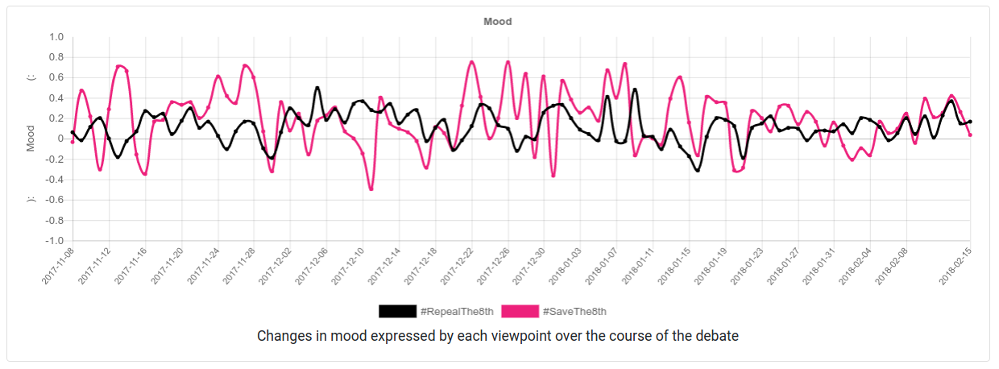

## Config
All the '8th debate' specific configuration including hashtags, colours,
timezone limits etc. have been moved to a separate config file. The only
specific thing that's not in there is the about page. I'm not sure if
there's much point trying to make that generic since it's pretty much all
8th debate specific. We can still say the 'entire core pipeline' is all
topic generic regardless.

## Smoothing
The values in the sentiment graph are now smoothed a little to try reduce
the noise. I experimented with a few different weights, and the option I'm
going with currently is `(0.6 * that_day) + (0.3 * day_before) + (0.1 *
2_days_before)`. The screenshots of the results are below:

#### No smoothing

#### (0.8 * today) + (0.2 * yesterday)

#### Selected configuration

## Analytics
I've set up Google Analytics on the main page and the about page. This will
be able to gather basic info on visitors including location, device, visit
duration etc... Depending on what sort of traffic levels we get, it could
be worth discussing in the report.

## Icon
I've added a favicon to the website. It's a figure 8 containing a happy
emoji and a sad emoji. It's not as clear as I'd like but I'm not sure
there's much that can be done when it's only displaying a 16px by 16px
image. It still looks better than a missing favicon though so we'll go with
it for the time being.
