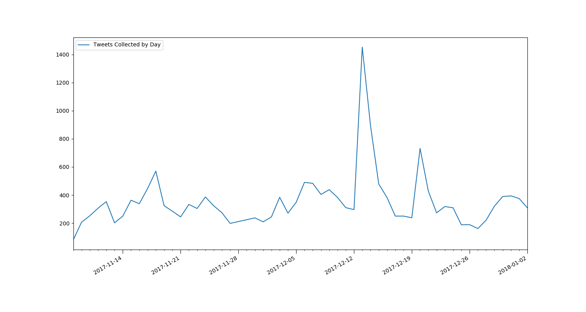
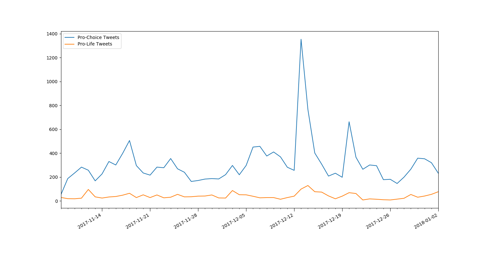
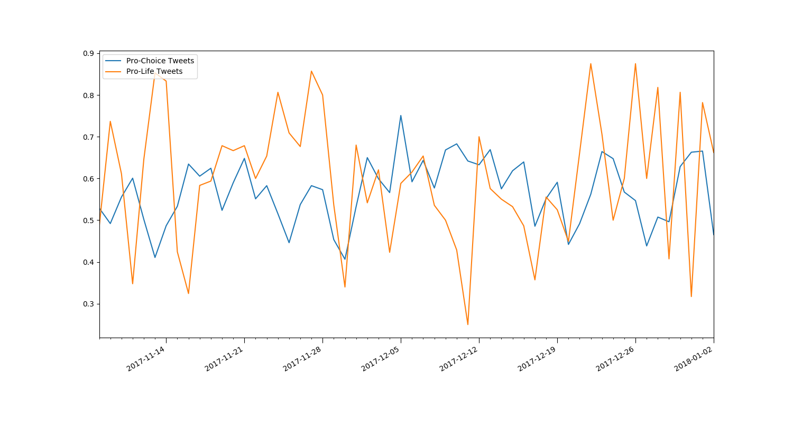

## Current Status
After taking the 2 months off for Christmas exams and recovery, it's time
to get this project back in shape for semester 2. Luckily, even though I
wasn't actively working on it, my pipeline was; We're now at ~20,000 tweets
collected and classified.

Semester 1 work focused mostly on ramp up and the first half of the pipeline
(ie Twitter -> Classifier -> DB). This gives us a good platform to work on
in semester 2 which will focus on the second half of the pipeline (ie DB ->
Analyser -> Client), polishing the whole thing and the write up.

Since starting back work on the project, I've set up a Redis instance as a
cache and created the initial version of the analyser microservice
(formerly the aggregator microservice). It currently just calculates
average daily sentiment for each viewpoint and stores it into the cache.

Next, I'll probably jump to the end of the pipeline and create the website.
It'll initially just use fake, hard-coded data to create the visualisations.
I'll then go back and create the websocket service, attach it to the cache
and the website, and that should be the full pipeline up and running. It'll
still require more development, especially for word clouds, but we'll have
end-to-end data flow that we can demonstrate at this stage.

## Initial Data Analysis
I developed a quick Python script to run certain queries against the data
and visualise the results using matplotlib. It was mostly to give me an
insight into the data we've collected so far and to see how we can visualise
it in the future. It'll also come in handy when we need to run once off
queries and visualisations, eg for thesis graphs.

It's given a number of good insights into the data that we wouldn't have
noticed otherwise. It's also highlighted a few problems however, but it's
probably better to be finding them out now that in 2 month's time when
everything is live.

***
#### Count of Tweets by Day:

This is the simplest visualisation, a count of tweets per day. It's probably
also the most interesting however. For example, the large spike on December
13th - the day the [Oireachtas committee voted to recommend repealing the
eighth amendment](https://www.rte.ie/news/2017/1213/927010-eighth_amendment)
. The lower spike on December 20th - the day the [Oireachtas Committee
published their final report, recommending a repeal of the eight amendment](https://www.rte.ie/news/2017/1220/928633-eighth-amendment-committee/).
There's also a slight dip from December 25th until December 28th - people
were less involved in the debate while celebrating Christmas.

Some other possible irregularities:
* November 18th spike - [Sinn Fein adopts a united party position to repeal
the eight amendment, rejecting proposals for a free vote on the topic.](https://www.irishtimes.com/news/politics/sinn-f%C3%A9in-rejects-proposal-for-free-vote-on-eighth-amendment-1.3297287)
* December 4th dip - A "day of drama" as Brexit dominated Irish news. First
it appeared a deal had finally been reached, until the DUP intervened and
blocked it [1](https://www.rte.ie/news/brexit/2017/1204/924815-single-market-eu-negotiations/)
[2](https://www.rte.ie/news/brexit/2017/1204/924815-single-market-eu-negotiations/)
[3](https://twitter.com/bbclaurak/status/937718845573394432)

***
#### Count of Tweets by Day by Viewpoint:

Not many interesting insights here that we don't have in the first chart,
except perhaps the December the 12th spike for #SaveThe8th tweets - possibly
caused by the [Row over apparent imbalance of witnesses for Oireachtas
Committee](https://www.rte.ie/news/politics/2017/1112/919483-sinn-fein-abortion/)
. This must have been much more important to the #Save side than the #Repeal
side.

The big (and problematic) piece of information in this chart is how
imbalanced our data is. There are a number of probable causes including:
* the main demographics on Twitter would be more likely to be pro-choice.
[1](https://sproutsocial.com/insights/new-social-media-demographics/#twitter)
[2](https://www.irishtimes.com/news/social-affairs/poll-shows-public-support-for-abortion-is-cautious-and-conditional-1.2995696)
* It's generally called a referendum on repealing the eight amendment as
opposed to a referendum on saving the eight amendment. This would mean
people discussing it could use #RepealThe8th as a tag for the topic without
necessarily expressing the viewpoint, while #SaveThe8th is specifically used to
express or refer to the viewpoint.

***
#### Average Sentiment by Day by Viewpoint:

This graph mostly just shows problems, which isn't great since it was
meant to be the key graph of the project...

The main issue is it's hard to extract any valuable knowledge from the
graph, it's too sensitive to noise. We might need to add in some smoothing
to help see trends easier (more later).

Some things we can't change:

1) #Save being very irregular: Since we saw above that #SaveThe8th is
getting far fewer tweets, it means it's more susceptible to noise. A few
extra negative tweets or a few retweets of the same negative tweet will
have much more of an impact since there's not many tweets to begin with.
This leads to massive swings like can be seen in the last week of the graph.
Nothing major was happening in the debate yet the #Save sentiment was
jumping all over the place. If the number of tweets increases as we get
closer to the referendum, that should help smooth out the graph.
2) Despite all the noise, the average sentiment on both sides is remarkably
similar. #Repeal has an overall average sentiment of 0.58349 while #Save is
0.59827. Given the accuracy of the classifier, we can't prove any difference
between the two sides' sentiment. It's not the most exciting result I'll
admit but it's what the data is showing at the moment. At some point in the
future, it might be worth classifying a sample of randomly selected tweets.
It'd be interesting to see if there's any major difference in the sentiment
of this debate versus that of regular Twitter content.
3) Given that both sides' average sentiment is actually positive,
'hateful8th' isn't quite as fitting a name as I'd have thought. It'll do for
now though, we can decide if it's worth changing at a later date.

### Smoothing
Adding in some sort of moving average to the visualisation might make sense.
It should help trends to become more visible as we remove some of the noise.
It makes sense that the average sentiment at a point in time isn't just what
was expressed that day, but maybe a combination of the last few days. We'd
have to be careful not to over-smooth the data in an attempt to reduce noise
however. It's probably something to consider further on in the development
process.
