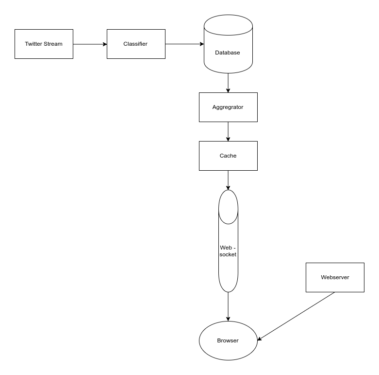

## Architecture
Since creating the PDD, the architecture has been changed slightly. It's
still all using the same components, just the links between them have been
simplified. I've updated the diagram with the current design.

## Websocket
The websocket service is written in Node.js, using the `ws` package. It
connects to the Redis cache and the browsers visiting the site. When a new
visitor loads the page, the websocket is connected and. It queries
the cache and sends on the latest results to  the client. The websocket
also watches for changes in the redis cache and as soon as any updates are
inserted, the new data is broadcast to all the connected clients. This
ensures the clients have access to the latest data in a very efficient
manner.

## Webserver
It's available at [hateful8th.com](http://hateful8th.com/)

Originally, the plan was to have a server side language dynamically creating
the HTML before sending it to the client. However, since we're already using
the websocket to send the latest data, I decided it'd be better not to
duplicate this functionality. Instead, I set up NGINX to serve a static HTML
file. When this loads, it connects to the websocket and is sent the latest
data.

Initially the page was created using hard coded datasets, just to get the
visualisations working. After setting up the websocket however, I changed
it to show real data where possible. The sentiment graph at the top is
using the Tweet data we've collected and analysed so far. It's updated
constantly as new data passes through the pipeline. The two word clouds are
sill using fake data however, as we're not generating those analytics yet.
