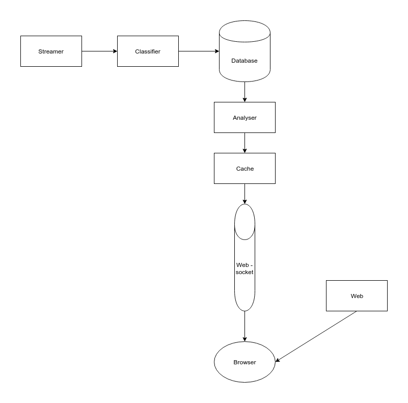

# Design

The project follows the Microservices software architecture pattern. This means the overall project is made up of small, modular, loosely coupled sub-systems which use lightweight network protocols to communicate. The Microservices pattern can be viewed as a variant of the more general Service-Orientated-Architecture (SOA) pattern. [1]

As each sub-system is independent, it gives them the freedom to use the technology stack that best suits its needs. For example, the websocket service which sends data updates to connected clients needs to be able to maintain low latency whilst under heavy load. Node.js, which uses an event-driven, non-blocking I/O model, matches these requirements perfectly. The websocket service was able to use Node.js to take advantage of this, despite the rest of the project being mostly written in Python. This wouldn't be possible if the system used a monolithic design, as the entire codebase would need to use the same language.

Another benefit of the independence of services is that the overall codebase is very modular. To understand how a certain service works, you only have to look at the code for that specific service, and possibly the format it uses to send or receive data from services it connects to. For larger projects, this has the benefit that small teams can own individual services rather than multiple teams stepping on each other's toes in a monolithic project. For a single developer project like this, it makes it very easy to refresh myself on how a service works if I haven't dealt with it for a while.

The services that together make up the entire system are as follows:
* **Streamer**: This service connects to Twitter's streaming API and receives the tweets we are interested in. Its role is to gather tweets, filter out any tweets deemed non-relevant and then send them onwards in the pipeline.
* **Classifier**: This service uses machine learning and natural language processing techniques to determine whether tweets are expressing a positive or a negative sentiment.
* **Database**: This stores the results of the data processing being done by the pipeline.
* **Analyser**: This analyses the data stored by the database microservice, looking for trends and general insights.
* **Cache**: This is short term storage for the results of the analyser. Rather than having to re-process all the data each time, we can store the most up to date version of it here.
* **Websocket**: This sends the latest results of the data analysis to the connected clients as soon as they are calculated. As it focuses on transferring time sensitive data, low latencies are highly important.
* **Web**: This sends HTML pages to the clients when they load the page. This HTML is then inflated using the data sent by the websocket service to display the latest results and analytics.

#### Figure 3.1: A system architecture diagram that displays the various microservices and how they connect to form the overall pipeline.

[1] - [Software Architecture Patterns](http://www.oreilly.com/programming/free/files/software-architecture-patterns.pdf) by Mark Richards
