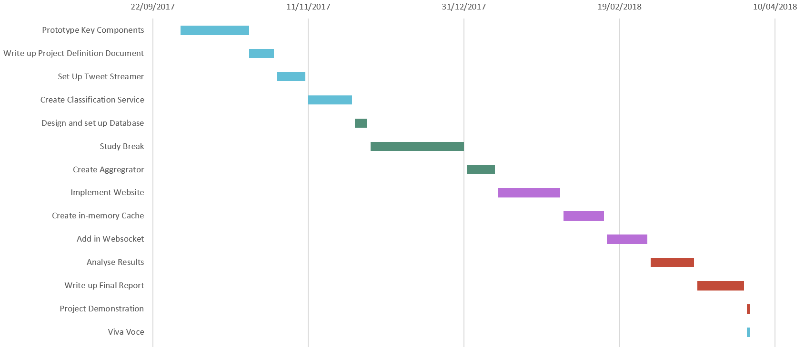
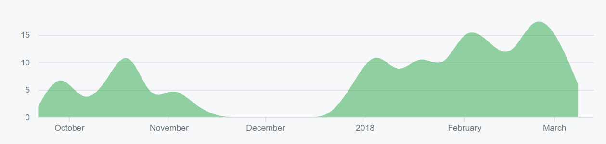
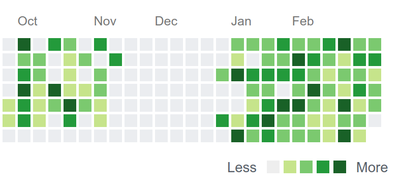

# Project Management

I tried to manage the project's workload over the course of the year to avoid overloading myself at any point. This involved estimating my workload from assignments and exams, and ensuring I had a lower project load during busy times. I also had to allocate the project enough time to ensure it was completed in time to collect and analyse sufficient Twitter data.

The initial deliverable for the project was the Project Definition Document. This contained a projected timeline and a Gantt chart which helped me plan out the course of the project. Although the development of the pipeline didn't follow the plan exactly, with certain parts taking less time and other parts taking more time than expected, it helped give an overall structure to the project. I could cross reference my progress throughout the year against the Gantt chart to get a feeling of where my project stood and to see if I was behind.

#### Figure X: Gantt chart of planned project progress from the Project Definition Document.

Throughout the project, I had weekly meetings with my supervisor. These helped ensure the constant rate of progress and I was able to get very regular feedback as my work progressed. To prepare for each of these, I created an overview document of what was achieved since we met last. This allowed my supervisor to quickly get an up to date summary of progress and saved us the time of me having to describe the progress during the meeting. The overall collection of these overview documents is also a great log of how the development effort went. They record what was achieved each week and any difficulties I encountered. This is a very useful record of progress that's easier to read than the git commit history.

GitHub, who host this project's git repository, provide a number of tools to visualise the activity level. These can clearly show the varying activity level in the repository over time.

#### Figure X: The amount of contributions to the master branch of the git repository over time, excluding merge commits.

This shows every time new code was added to the master branch. The activity starts in late September when I began the project. It then fluctuates until mid November. This is when I put the project on-hold as I started to focus on end of semester exam study. After taking a break for Christmas, activity resumed in early January. This continued at a higher pace until March, which is roughly when most of the development work of the project finished. The activity levels reduced after that as the effort shifted to report writing, which resulted in fewer commits.

#### Figure X: This shows the number of daily contributions by my GitHub account over the time period of the project.

This is my GitHub account's calculated activity level over the same period. Although some of the activity is related to other repositories, the vast majority of it is associated with this project's repository. Each column is a week beginning with Sunday and ending with Saturday. The lightest green squares mean 1 contribution, while the darkest green squares mean 9. A day that's a grey square means no activity took place. This visualisation matches up very well with the activity rate in the visualisation above as they both record similar events. One interesting insight that can be seen in this visualisation is the change in activity levels on Saturday. During the 2017 period of activity, every Saturday is marked as grey as I used take them off from college work. When I started back working on the project in 2018, I upped the intensity levels and started working all 7 days a week on it. This can be seen in the relative lack of grey squares over the 2018 activity period.
