# Results

The primary goal of the project has been fulfilled. We have created a microservice based, machine learning pipeline, that can collect, classify and analyse Twitter data on any divisive domain and display these results in a web based dashboard in real time. We have used the run up to the referendum on repealing the 8th amendment in Ireland as an initial, real world test case to validate the system.

## Raw Data
The pipeline has been running almost constantly since the 8th of November, 2017. Since then, it has collected over 120,000 Tweets regarding the 8th amendment debate. This makes it an extremely valuable corpus detailing the run up to one of the most important and controversial referenda in recent Irish history. It is my intention to keep the pipeline running until after the referendum is held, to increase the coverage of the dataset. Although this project will be finished by then, it would seem like a waste of a major opportunity to not keep the pipeline running until the end.

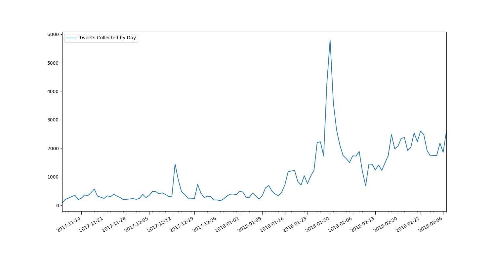
#### Figure X: The number of Tweets collected daily since the pipeline began.

This graph is quite a simple visualisation of daily Tweet count. It does highlight many of the key events of the campaign so far, showing Twitter is being used to discuss news as it breaks. Some of the important events that have a noticeable impact on the graph include:
* 2017-11-18: [Sinn Féin adopts a united party position to repeal the eight amendment, rejecting proposals for a free vote on the topic.](https://www.irishtimes.com/news/politics/sinn-f%C3%A9in-rejects-proposal-for-free-vote-on-eighth-amendment-1.3297287)
* 2017-12-13: [Oireachtas committee votes to recommend repealing the eighth amendment.](https://www.rte.ie/news/2017/1213/927010-eighth_amendment/)
* 2017-12-20: [Oireachtas committee publishes final report, recommending a repeal of the 8th amendment.](https://www.rte.ie/news/2017/1220/928633-eighth-amendment-committee/)
* 2018-01-10: [Taoiseach raises concern that allowing abortion up to 12 weeks may be a step too far.](https://www.irishtimes.com/news/politics/proposal-to-allow-abortion-up-to-12-weeks-may-be-a-step-too-far-taoiseach-1.3351057)
* 2018-01-17: [8th amendment debate commences in the Dáil.](https://www.rte.ie/news/2018/0117/933884-eighth_amendment/)
* 2018-01-26: [First poll shows majority want to repeal the 8th amendment.](https://www.irishtimes.com/news/politics/repeal-side-takes-early-lead-after-round-one-of-abortion-campaign-1.3368780)
* 2018-01-29: [Government formally decides to hold referendum. Taoiseach declares support for repealing the 8th amendment.](https://www.rte.ie/news/ireland/2018/0129/936851-cabinet-eighth-amendment/)
* 2018-02-10: An outage in the pipeline results in a number of hours of Tweets being missed.
* 2018-02-18: [Regina Doherty TD says unless something is done, the referendum will not pass.](https://www.rte.ie/news/health/2018/0218/941613-eighth-amendment/)
* 2018-02-21: [Dáil debate on 8th referendum concludes.](https://www.rte.ie/news/politics/2018/0221/942539-eighth-amendment-dail/)
* 2018-03-07: [Supreme court finds the unborn does not have constitutional rights outside right to life.](https://www.rte.ie/news/2018/0307/945560-supreme-court-rights-of-unborn/)

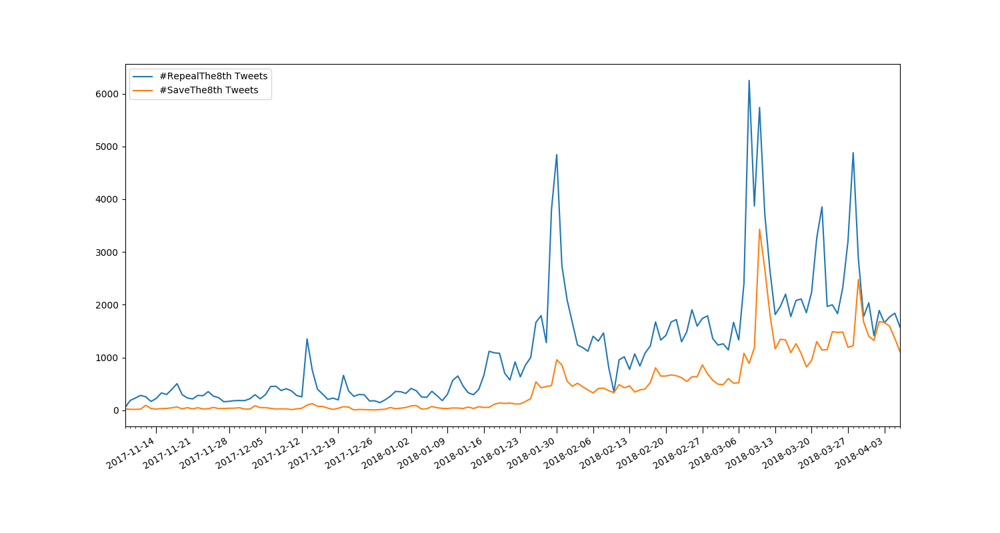
#### Figure X: The number of Tweets collected daily since the pipeline began, split by viewpoint.

Here we see the daily Tweet count, split into the distinct viewpoints. The most obvious piece of information from this graph is the difference in volume of Tweets from either side. #RepealThe8th is a much more common term than #SaveThe8th. This would be expected however as the main demographics on Twitter are more likely to be pro-choice [1] [2]. It is hard to make comparisons between the 2 activity levels, due to the large difference between them. To counteract this, I graphed the same data, but normalised it by the average Tweet count for that particular viewpoint.

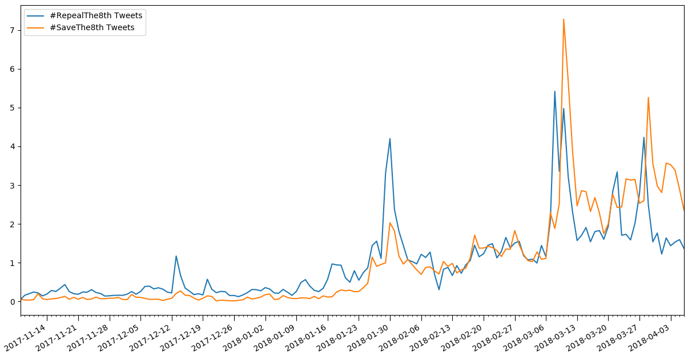
#### Figure X: The number of Tweets per day for each viewpoint, relative to the average number of daily Tweets for that viewpoint.

This gives us a far clearer comparison between the two viewpoints' activity levels. We can see there are certain news stories that are far more important for one side than the other. E.g. The Taoiseach raising concerns that allowing abortion up to 12 weeks may be a step too far on January 10th led to a large jump in Repeal Tweets but almost no change in Save activity levels. The supreme court finding the unborn does not have constitutional rights outside right to life was a much more important issue to the Save side than the Repeal side however. Another clear feature of this graph is the increase in Twitter activity from both sides over time. The Save activity noticeably increased after the first poll showed Repeal with an early lead, on January 26th. As the referendum date gets nearer, we can expect to see further growth in activity levels from both sides.

## Tweet Time Analysis
What time people tend to Tweet about this debate at is another area to explore. As can be seen from above, large spikes in Twitter activity tend to follow big news breaking. I analysed the timestamps of all the Tweets the pipeline has classified to see if any interesting information could be extracted. Potentially, this sort of data could be used by groups to maximise exposure for Twitter campaigns on the topic.

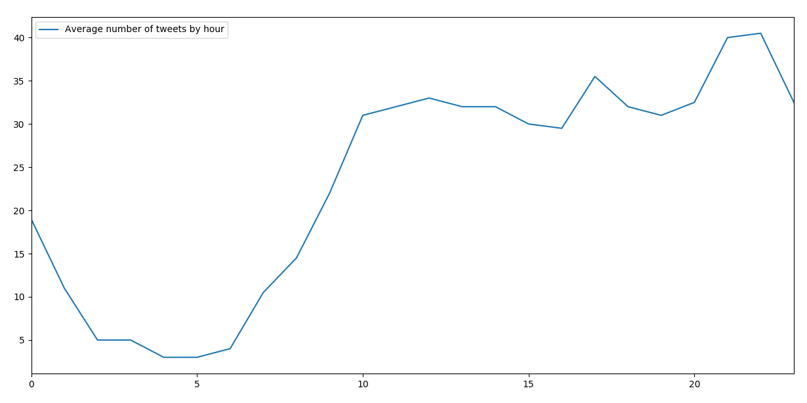
#### Figure X: The median number of Tweets per hour of the day.

I used the median number of Tweets as I felt using a mean average would result in outliers from large news stories distorting the true Tweet pattern. The graph looks quite like what you would expect. It's at its lowest at about 5 a.m., when most people would be asleep. It then climbs steadily from 6 a.m. until 10 a.m. when it plateaus. This corresponds to most of the population waking up and getting ready in the morning. The Tweet levels stay quite steady until after 4 p.m.. There is a small spike at 5 p.m. which matches people finishing work and perhaps catching up on the day's activity on Twitter. It slumps a little from 6 p.m. until 8 p.m. which is when people would likely be getting dinner. There's then a larger spike in activity from 9 p.m. until 10 p.m when people might be relaxing on social media at the end of the day. The Tweet levels then start to drop fairly  consistently until about 2 a.m., where they bottom out until about 6 a.m.. The activity levels matching an average Irish person's day so closely also imply there's little foreign influence in the data. If the Tweet peak was at 4 a.m., that would be unexpected and probably a sign of something going wrong, as the activity would likely be coming from another part of the world that was mostly awake at that time. The lack of surprising results can be considered a good sign that our data is likely valid.

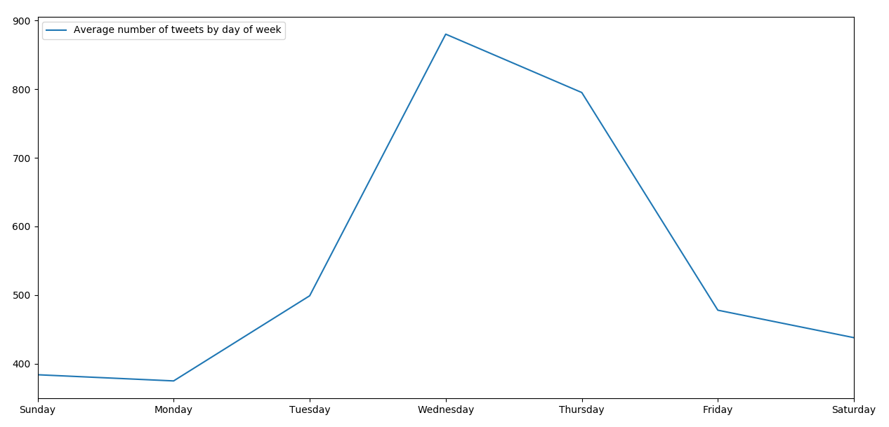
#### Figure X: The median number of Tweets per day of the week.

Again, the median was calculated as very important days during the debate would be large outliers. Unlike the hour of the day graph, this one doesn't really have a shape that could be easily predicted. It would be hard to know in advance what days would be more active than others. Surprisingly, the most active day for Tweets on the topic was Wednesday. The middle of the week seemed to be the busiest portion with Wednesday, Thursday and Tuesday making up the top 3 most active days. The weekend and its surrounding days were much quieter overall. Potentially this could be explained by the majority of Twitter activity on the issue being reactionary. If TDs or campaigners aren't working at the weekends, there is less to react to which reduces activity. There could be a number of factors that are influencing this graph however.

## Sentiment

Analysing sentiment is the most challenging aspect of the project. Despite the classifier having an accuracy rate of slightly over 80%, which is marginally better than average human accuracy, it still results in almost 1 in 5 Tweets being mis-classified. This adds an extra layer of uncertainty which makes extracting information form the data more difficult. In order to reduce the noise in the calculated sentiment data, I calculated a weighted moving average for the sentiment on any given day. I felt this would be a fairer figure as many people wouldn't Tweet about the topic every day, but their sentiment towards it would be unlikely to change drastically in a short period of time. This smoothed the data, making any trends contained in the data easier to see.

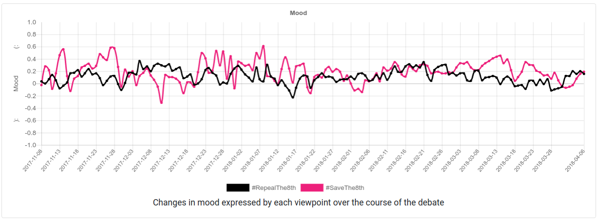
#### Figure X: The sentiment over the course of the debate so far.

This shows the smoothed sentiment calculated so far by the pipeline. It is displayed in the range [-1,1] as we found this to be a more user friendly option than the usual range of [0,1]. For the remainder of this section, all figures for sentiment will be given for the [-1,1] range to keep consistency with the graph.

It can clearly be seen from this graph that the sentiment values were more extreme nearer the start of the debate, especially on the Save side. This is more likely to do with the lower levels of Twitter activity nearer the start, than any calming of discussion. As seen in the above subsections, there was very little Save Twitter activity in the first few months of measurements. This means noise had a far greater impact as a few extra negative Tweets in a day noticeably brought down the average. From mid-January onwards, all daily values have kept within the [-0.2,0.4] interval. This coincides with the increase in Twitter activity discussed above.

Unlike the above section on Tweet volumes, it is much harder to link any changes in the graph to specific events in the campaign. The rate of Tweets may increase but the overall sentiment doesn't swing outside of the usual fluctuation zone. The overall sentiment levels are too changeable to say with any confidence that a particular fluctuation was caused by a specific event. As the referendum draws nearer, it's possible that reactions to certain news stories would be more uniform, resulting in clearer changes in sentiment. An example of this would be on results day, where we would expect very positive Tweets from the winning side and potentially very negative Tweets from the other.

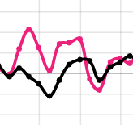
#### Figure X: Sentiment levels moving in the same directions.

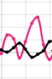
#### Figure X: Sentiment levels moving in opposite directions.

Interestingly, a number of patterns are visible in the sentiment data between the 2 sides. For some short periods of time, both sentiment levels tend to change in a synchronised manner (fig. X above). They rise and fall on the same days, even when there's a large gap in their real values. A possible explanation for this is that sentiment expressed by one side is reacted to in a similar manner by the other side. A polite debate would likely result in positive sentiment from both sides, whereas an angry one would likely result in negative sentiment. Inversely, for other short periods of time, they move in opposite directions (fig. X above). This is probably closer to what one might expect, as positive news for one side would likely be negative news for the other (e.g. poll results showing one side has a large lead).

The overall average sentiment for Repeal Tweets is 0.1415 and for Save Tweets is 0.2017. Surprisingly, both values are positive meaning the debate might not be as negative as some feared it would be. It also shows Save supporters may be slightly more positive than Repeal supporters, although there is very little between the two sides.

## Word Clouds

Some of the most interesting findings from the pipeline have come from the word clouds. They were designed to show any differences in the language between the two sides, and also show what topics they were each most interested in at a given time. They only focus on recent discussion to get an idea of the trending topics, so they can be seen as a looking glass into the current status of the debate.


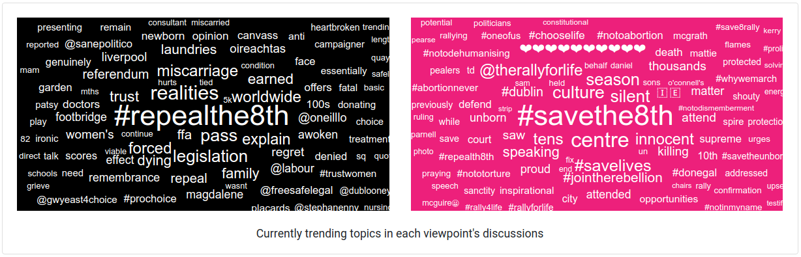
#### Figure X: The trending topics in the word clouds, on March 11th 2018.

This image of the word clouds shows the different types of language used by both sides in the debate. Repeal, for example, frequently used terms including:
* magdalene laundries
* miscarriage
* ffa (Fatal Foetal Abnormalities)
* forced
* #TrustWomen

In general, these topics focus on the woman's rights and experiences. Save, on the other hand, uses terms including:
* innocent
* unborn
* killing
* #NoToTorture
* #SaveLives

Save seem to be using more emotive language focusing more on the unborn. Although this is only a single snapshot of the word clouds, the same style of arguments and terms re-appear regularly from their respective sides.

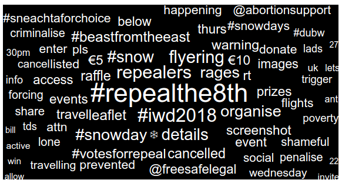
#### Figure X: The Repeal word cloud from March 2nd, when Ireland was suffering a massive snow storm.

Another strategy, used particularly by the Repeal side, that was highlighted by the word clouds was the linking of the debate to other news stories. The repeal word cloud, from when Ireland was suffering a large snowstorm on the 2nd of March, clearly shows this concept. Many of the trending terms are to do with the weather, including:
* #snow
* #snowday
* #SneachtaForChoice (sneachta being the Irish word for snow)
* #BeastFromTheEast
* ❄️

Initially looking at these, there's no clear relevance to the debate. After cross checking them on Twitter however, a narrative became clear. People were Tweeting about the women who'd be trying fly to the UK for an abortion, but who were prevented travelling due to flights being cancelled. By linking their agenda to the most popular news story, they were hoping to get focus back to their arguments.

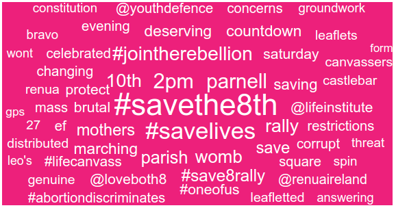
#### Figure X: The Save word cloud from February 26th, when they were promoting a rally.

Dates and times for events are commonly very popular terms in the word clouds, since they are likely only related to one side. An example is this Save cloud, where we can see the key details of the "All-Ireland Rally for Life". This was taking place on Saturday the 10th of March, from 2pm in Parnell square, and was organised by Youth Defence [3].

## Configurable Pipeline
Although all the above results are specific to the 8th amendment referendum debate, the core pipeline is entirely configurable. To demonstrate this, I modified the config.json file that determines the target topic and didn't touch anything else. I then re-deployed the pipeline and collected a small set of new results. The new topic I chose was the battle between 2 highly popular gaming consoles in America, the Nintendo Switch and the PlayStation 4. The modified config.json file is as follows:
```` json
{
    "topic1": {
        "name": "#NintendoSwitch",
        "colour": "#e80113"
    },
    "topic2": {
        "name": "#PS4",
        "colour": "#06418d"
    },
    "name": "Console Wars",
    "tagline": "Real time Gaming Console analysis on Twitter",
    "supportedLanguages": ["en"],
    "supportedTimezones": ["Eastern Time (US & Canada)", "Central Time (US & Canada)",
        "Mountain Time (US & Canada)", "Pacific Time (US & Canada)"]
}
````
This specifies all the details that are specific to the topic being analysed. As can be seen from the configuration file, the pipeline was set up to analyse Tweets containing either #NintendoSwitch or #PS4 from North America in English. After leaving this pipeline running for a few hours, this is what the results page looked like:

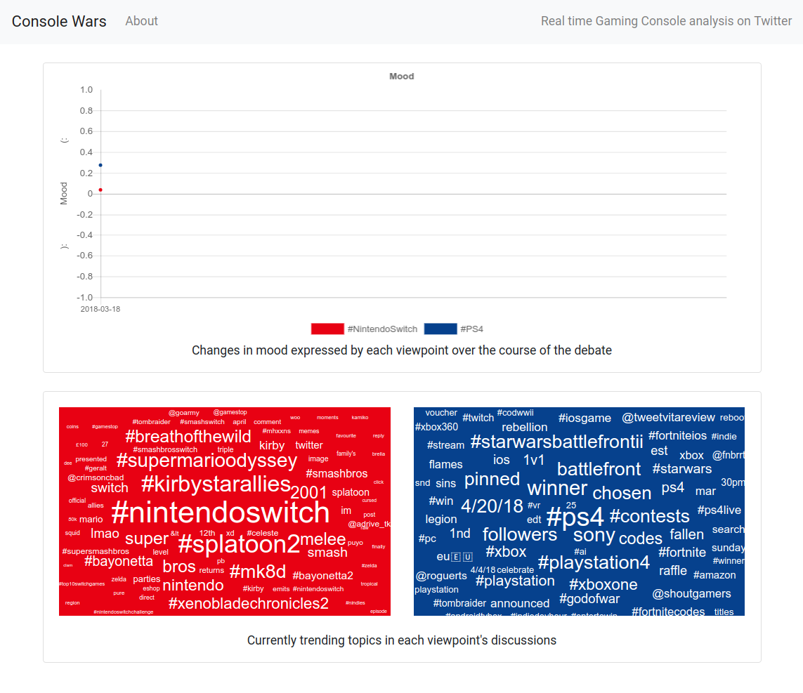
#### Figure X: This shows the web frontend of the pipeline after collecting data on gaming console discussion from North America over a few hours.

With only a few hours of data collected, it's clearly not enough to draw any results from. It does show however that the pipeline can be pointed at another target and work perfectly. The sentiment chart looks broken but that's only because it contains a single point of data, which can be seen on the far left of the chart. Had I run the pipeline over 2 or more days, a proper graph of sentiment level changes would be seen. The word clouds both work perfectly in this new domain, although again more data would result in a better representation of the state of the debate. The #NintendoSwitch word cloud (in red) in particular looks sparse around the edges due to a lack of data.

[1] - [Twitter Demographics](https://sproutsocial.com/insights/new-social-media-demographics/#twitter)

[2] - [Poll shows public support for abortion is cautious and conditional](https://www.irishtimes.com/news/social-affairs/poll-shows-public-support-for-abortion-is-cautious-and-conditional-1.2995696)

[3] - [All-Ireland Rally for Life](http://cloynediocese.ie/event/save-8th-rally-dublin/)
