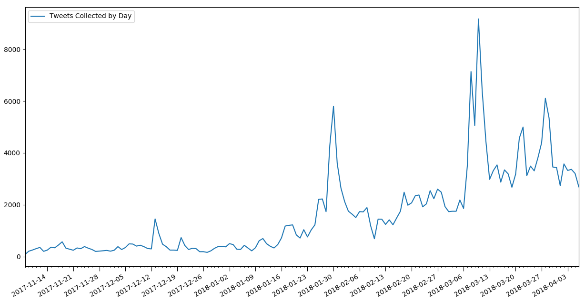
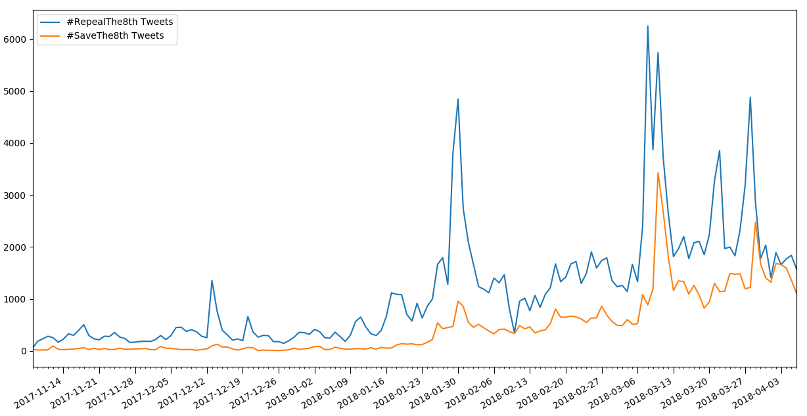

# Results

The primary goal of the project has been fulfilled. We have created a microservice based, machine learning pipeline, that can collect, classify and analyse Twitter data on any divisive domain and display these results in a web based dashboard in real time. We have used the run up to the referendum on repealing the 8th amendment in Ireland as an initial, real world test case to validate the system.

## Raw Data
The pipeline has been running almost constantly since the 8th of November, 2017. Since then, it has collected over 120,000 Tweets regarding the 8th amendment debate. This makes it an extremely valuable corpus detailing the run up to one of the most important and controversial referenda in recent Irish history. It is my intention to keep the pipeline running until after the referendum is held, to increase the coverage of the dataset. Although this project will be finished by then, it would seem like a waste of a major opportunity to not keep the pipeline running until the end.

#### Figure X: The number of Tweets collected daily since the pipeline began.

This graph is quite a simple visualisation of daily Tweet count. It does highlight many of the key events of the campaign so far, showing Twitter is being used to discuss news as it breaks. Some of the important events that have a noticeable impact on the graph include:
* 2017-11-18: [Sinn Féin adopts a united party position to repeal the eight amendment, rejecting proposals for a free vote on the topic.](https://www.irishtimes.com/news/politics/sinn-f%C3%A9in-rejects-proposal-for-free-vote-on-eighth-amendment-1.3297287)
* 2017-12-13: [Oireachtas committee votes to recommend repealing the eighth amendment.](https://www.rte.ie/news/2017/1213/927010-eighth_amendment/)
* 2017-12-20: [Oireachtas committee publishes final report, recommending a repeal of the 8th amendment.](https://www.rte.ie/news/2017/1220/928633-eighth-amendment-committee/)
* 2018-01-10: [Taoiseach raises concern that allowing abortion up to 12 weeks may be a step too far.](https://www.irishtimes.com/news/politics/proposal-to-allow-abortion-up-to-12-weeks-may-be-a-step-too-far-taoiseach-1.3351057)
* 2018-01-17: [8th amendment debate commences in the Dáil.](https://www.rte.ie/news/2018/0117/933884-eighth_amendment/)
* 2018-01-26: [First poll shows majority want to repeal the 8th amendment.](https://www.irishtimes.com/news/politics/repeal-side-takes-early-lead-after-round-one-of-abortion-campaign-1.3368780)
* 2018-01-29: [Government formally decides to hold referendum. Taoiseach declares support for repealing the 8th amendment.](https://www.rte.ie/news/ireland/2018/0129/936851-cabinet-eighth-amendment/)
* 2018-02-10: An outage in the pipeline results in a number of hours of Tweets being missed.
* 2018-02-18: [Regina Doherty TD says unless something is done, the referendum will not pass.](https://www.rte.ie/news/health/2018/0218/941613-eighth-amendment/)
* 2018-02-21: [Dáil debate on 8th referendum concludes.](https://www.rte.ie/news/politics/2018/0221/942539-eighth-amendment-dail/)
* 2018-03-07: [Supreme court finds the unborn does not have constitutional rights outside right to life.](https://www.rte.ie/news/2018/0307/945560-supreme-court-rights-of-unborn/)

#### Figure X: The number of Tweets collected daily since the pipeline began, split by viewpoint.

Here we see the daily Tweet count, split into the distinct viewpoints. The most obvious piece of information from this graph is the difference in volume of Tweets from either side. #RepealThe8th is a much more common term than #SaveThe8th. This would be expected however as the main demographics on Twitter are more likely to be pro-choice [1] [2]. It is hard to make comparisons between the 2 activity levels, due to the large difference between them. To counteract this, I graphed the same data, but normalised by the average Tweet count for that particular viewpoint.

#### Figure X: The number of Tweets per day for each viewpoint, relative to the average number of daily Tweets for that viewpoint.

This gives us a far clearer comparison between the two viewpoints' activity levels. We can see there are certain news stories that are far more important for one side than the other. E.g. The Taoiseach raising concerns that allowing abortion up to 12 weeks may be a step too far on January 10th led to a large jump in Repeal Tweets but almost no change in Save activity levels. The supreme court finding the unborn does not have constitutional rights outside right to life was a much more important issue to the Save side than the Repeal side however. Another clear feature of this graph is the increase in Twitter activity from both sides over time. The Save activity noticeably increased after the first poll showed Repeal with an early lead, on January 26th. As the referendum date gets nearer, we can expect to see further growth in activity levels from both sides.

[1] - [Twitter Demographics](https://sproutsocial.com/insights/new-social-media-demographics/#twitter)

[2] - [Poll shows public support for abortion is cautious and conditional](https://www.irishtimes.com/news/social-affairs/poll-shows-public-support-for-abortion-is-cautious-and-conditional-1.2995696)
